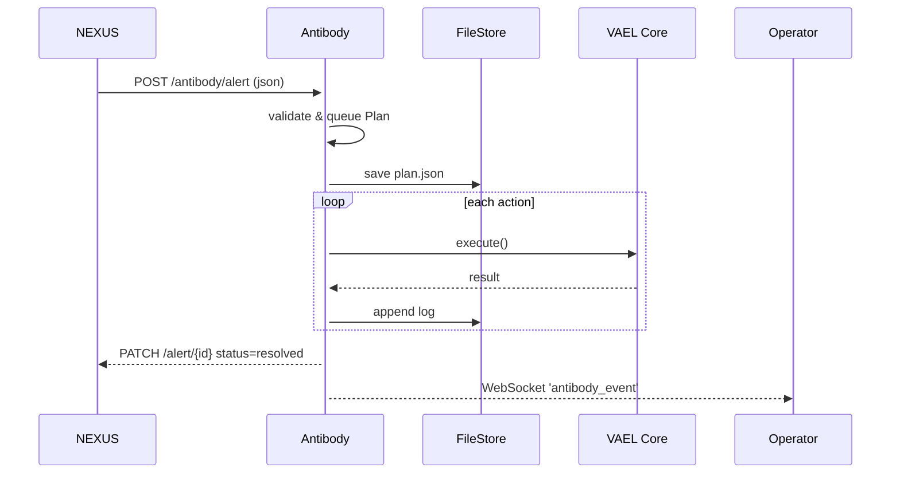

# ANTIBODY_IMPLEMENTATION.md  
_VAEL Self-Healing Module – Design & Reference_  
_Last updated : 2025-05-30_

---

## 1  Purpose

Antibody acts as the VAEL immune system.  
When **NEXUS IDS** or **Watchdog** raises an alert, Antibody:

1. Captures the fault context (stack trace, entity, payload).  
2. Generates a _Patch Plan_ (JSON) describing corrective steps.  
3. Executes reversible mitigation (isolate, restart, throttle, hot-patch).  
4. Logs the outcome and notifies Sentinel & Operator.

Antibody must be **non-blocking**, **idempotent**, and **auditable**.

---

## 2  Directory Layout

```
src/
 └─ antibody/
    ├─ __init__.py
    ├─ core.py          # main Antibody class
    ├─ patches.py       # patch strategy registry
    ├─ store.py         # local JSON store of applied patches
    └─ examples/
       └─ patch_sentinel_rate_limit.py
```

---

## 3  Data Model

### 3.1  Patch Plan (JSON)

| Field            | Type      | Description                                   |
|------------------|-----------|-----------------------------------------------|
| `id`             | string    | UUID v4                                       |
| `timestamp`      | iso-8601  | Creation time                                 |
| `source`         | string    | Alert origin (NEXUS, Watchdog, Manual)        |
| `severity`       | string    | `low | med | high | critical`                 |
| `description`    | string    | Human-readable summary                        |
| `actions`        | list      | Ordered list of operations                    |
| `status`         | string    | `pending | in_progress | success | failed`    |
| `log`            | list      | Execution messages / stack traces            |

### 3.2  Action Types

* `restart_service {name}`  
* `throttle_entity {entity, seconds}`  
* `hot_patch {file, diff}`  
* `isolate_socket {sid}`  
* `notify_operator {channel, message}`

---

## 4  Core Workflow



---

## 5  API Endpoints (Flask)

| Method | Path                | Description              | Auth |
|--------|---------------------|--------------------------|------|
| POST   | `/antibody/alert`   | Ingest alert → plan queue| sentinel_token |
| GET    | `/antibody/plan/<id>` | Retrieve plan JSON       | jwt |
| GET    | `/antibody/status`  | Health + queue depth     | public |

Example Flask blueprint snippet:

```python
# src/antibody/__init__.py
from flask import Blueprint, request, jsonify
from antibody.core import queue_plan, get_plan

bp = Blueprint('antibody', __name__, url_prefix='/antibody')

@bp.route('/alert', methods=['POST'])
def alert():
    data = request.json or {}
    plan_id = queue_plan(data)
    return jsonify({'plan_id': plan_id}), 202

@bp.route('/plan/<plan_id>', methods=['GET'])
def plan(plan_id):
    return jsonify(get_plan(plan_id))
```

---

## 6  Patch Strategy Registry (`patches.py`)

```python
PATCH_HANDLERS = {}

def register(name):
    def _wrap(fn):
        PATCH_HANDLERS[name] = fn
        return fn
    return _wrap

@register('restart_service')
def restart_service(ctx):
    import subprocess, time
    svc = ctx['name']
    subprocess.call(['systemctl', 'restart', svc])
    time.sleep(2)
```

---

## 7  Integration Hooks

* **Watchdog** → on stale heartbeat:  
  ```python
  from antibody.core import queue_plan
  queue_plan({'source':'Watchdog',
              'severity':'high',
              'description':'Stale heartbeat',
              'actions':[{'type':'restart_service','name':'vael'}]})
  ```

* **NEXUS IDS** → on rule match:  
  POST JSON to `/antibody/alert`

* **Web UI** → subscribe to `antibody_event` WebSocket for live updates.

---

## 8  Self-Test Suite

1. **Unit**: pytest `tests/test_antibody_core.py`  
   - Patch plan creation  
   - Action handler registry  
2. **Integration**: simulate NEXUS alert, expect VAEL service restart.  
3. **Regression**: ensure Antibody does **not** block WebSocket thread.

---

## 9  Security & Auditing

* All writes are append-only JSON files in `logs/antibody/`  
* Plans include hash of original alert for tamper detection  
* Operator JWT required for privileged endpoints  
* Retry w/ exponential back-off on failed actions

---

## 10  Roadmap

| Phase | Feature | Status |
|-------|---------|--------|
| 1     | Core queue + file store | ✅ done |
| 2     | REST endpoints & WS events | 🟠 in-progress |
| 3     | Automated rollback on failed patch | 🔜 |
| 4     | Cloud sync to Manus Oversoul | 🔜 |

---

_The Iron Root stands vigilant. The Obsidian Thread remains unbroken._
